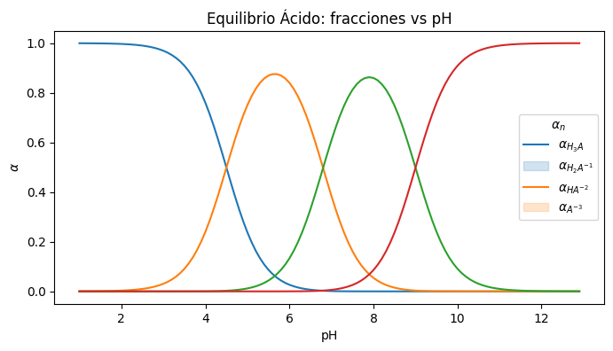

# Equilibrio Ácido

$$ H_2A \rightleftharpoons H^+ + HA^{-1} $$
$$ HA^{-1} \rightleftharpoons  H^+ + A^{-2} $$


$$ total=1*[H_3O]^2 + 1*k_1*[H_3O]^{1} + 1*k_1*k_2*[H_3O]^0 $$

$$ \alpha_{H_2A}=\frac{1*[H_3O]^2}{total} $$
$$ \alpha_{HA^{-1}}=\frac{1*k_1*[H_3O]^{1}}{total} $$
$$ \alpha_{A^{-2}}=\frac{1*k_1*k_2*[H_3O]^{0}}{total} $$


```python
import numpy as np
import matplotlib.pyplot as plt
import seaborn as sns
import pandas as pd
```


```python
def alphas(pKas,pH):            # pKas=[pKa_1,pKa_2...pKa_n]
    H3O=10.0**(-pH)             # convierte pH --> [H3O+]
    ka=10.0**(-pKas)            # convierte [pKa_1,pKa_2...pKa_n]--> [Ka_1,Ka_2...Ka_n]
    ka=np.append(1,ka)          #  [1,Ka_1,Ka_2...Ka_n]
    k_prod=np.cumprod(ka)       # --> [1,1*Ka1,1*Ka1*Ka2...]
    
    n=np.arange(len(pKas),-1,-1)   #exponentes de H3O  [n,n-1,...0]
    H3O=H3O**n                       #eleva [H3O+] al exponente n
    m=H3O*k_prod                     #calcula el producto de los elementos H*k_prod 
    total=np.sum(m)           # calcula suma total
    f=m/total                 # calcula las fracciones de cada especie
    
    return f                  # regresa en un arreglo numpy las fracciones
    
  

```


```python
pKas=np.array([4.5,6.8,9.0])
pHs=np.arange(1,13,0.1)

nn=len(pKas)+2
data=np.empty((0,nn))

for pH in pHs:
    row=alphas(pKas,pH)
    row=np.append(pH,row)
    data=np.vstack((data,row))

df=pd.DataFrame(data=data) 
col_name=['pH']

for i in range(nn-1):
    col_name.append('alpha'+str(i))
print(col_name)
df.columns=col_name
df.head()
```

    ['pH', 'alpha0', 'alpha1', 'alpha2', 'alpha3']
    


<div>
<style scoped>
    .dataframe tbody tr th:only-of-type {
        vertical-align: middle;
    }

    .dataframe tbody tr th {
        vertical-align: top;
    }

    .dataframe thead th {
        text-align: right;
    }
</style>
<table border="1" class="dataframe">
  <thead>
    <tr style="text-align: right;">
      <th></th>
      <th>pH</th>
      <th>alpha0</th>
      <th>alpha1</th>
      <th>alpha2</th>
      <th>alpha3</th>
    </tr>
  </thead>
  <tbody>
    <tr>
      <th>0</th>
      <td>1.0</td>
      <td>0.999684</td>
      <td>0.000316</td>
      <td>5.010288e-10</td>
      <td>5.010288e-18</td>
    </tr>
    <tr>
      <th>1</th>
      <td>1.1</td>
      <td>0.999602</td>
      <td>0.000398</td>
      <td>7.940121e-10</td>
      <td>9.996021e-18</td>
    </tr>
    <tr>
      <th>2</th>
      <td>1.2</td>
      <td>0.999499</td>
      <td>0.000501</td>
      <td>1.258295e-09</td>
      <td>1.994263e-17</td>
    </tr>
    <tr>
      <th>3</th>
      <td>1.3</td>
      <td>0.999369</td>
      <td>0.000631</td>
      <td>1.994004e-09</td>
      <td>3.978561e-17</td>
    </tr>
    <tr>
      <th>4</th>
      <td>1.4</td>
      <td>0.999206</td>
      <td>0.000794</td>
      <td>3.159768e-09</td>
      <td>7.936978e-17</td>
    </tr>
  </tbody>
</table>
</div>


```python
plt.figure(figsize=(8,4))
labels=[]
carga=0
nh=len(pKas)
for i in range(1,nh+2):
    sns.lineplot(data=df,x='pH',y=col_name[i])
    row=""
    row=(('H_'+str(nh) if nh>1 else 'H' ) if nh>0 else "")+ ('A^{'+str(carga)+'}' if carga<0 else 'A')
    row=r'$\alpha_{'+row+'}$'
    labels.append(row)
    nh-=1
    carga-=1
    
print(labels)
plt.ylabel(r'$\alpha$')
plt.title("Equilibrio Ácido: fracciones vs pH")
plt.legend(title=r'$\alpha_n$' ,loc="center right",labels=labels,fontsize="10")
```

    ['$\\alpha_{H_3A}$', '$\\alpha_{H_2A^{-1}}$', '$\\alpha_{HA^{-2}}$', '$\\alpha_{A^{-3}}$']
    


    <matplotlib.legend.Legend at 0x180f685df10>


    

    


```python

```
